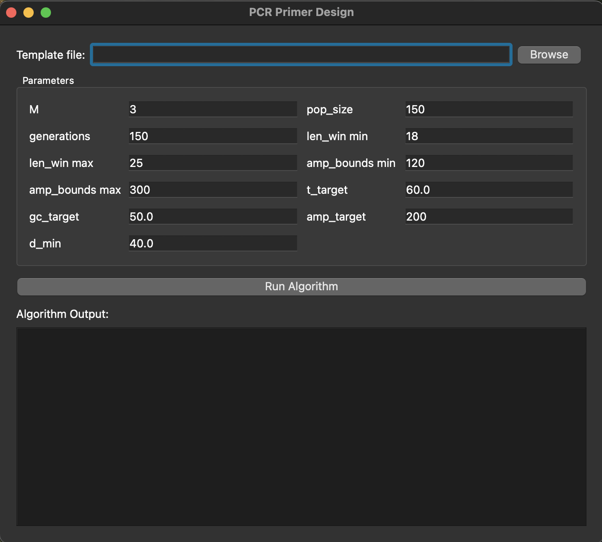
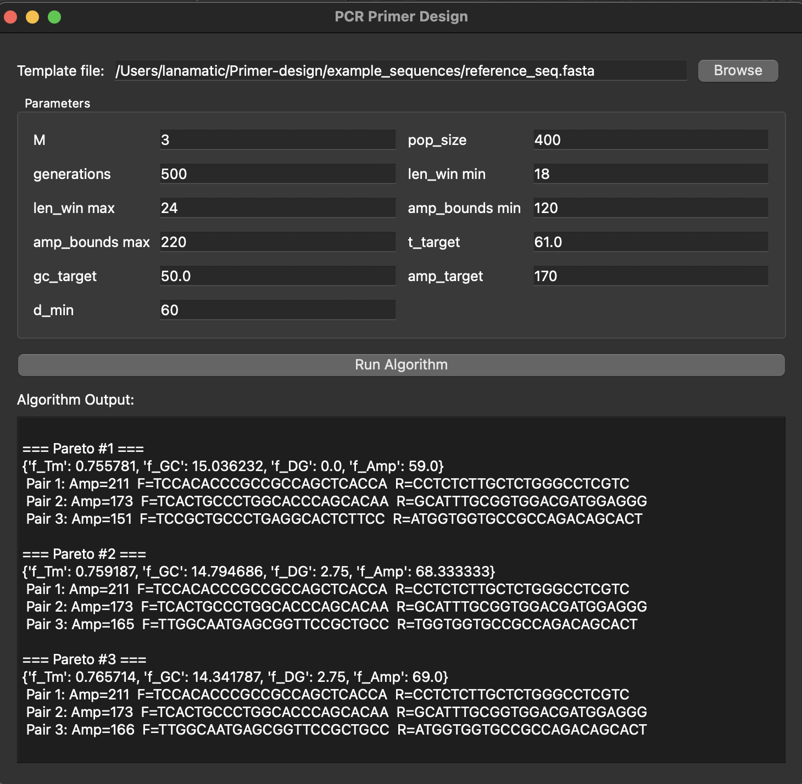

# Primer Design for PCR using Genetic Algorithms and Pareto Optimization
This project was developed for the Computer Intelligence course and demonstrates how genetic algorithms (GA) and multi-objective Pareto optimization (NSGA-II) can be used to design DNA primers for PCR (Polymerase Chain Reaction).

It includes:
- Simple GA mode – designs a single primer pair using one aggregated fitness function.
- Multiplex NSGA-II mode – designs multiple primer pairs simultaneously, using multi-objective optimization (Tm, GC content, dimer/hairpin energy, amplicon size and spacing).
- A PyQt5 graphical user interface for loading DNA sequences and running multiplex algorithms interactively.
- Full technical documentation in Serbian located in the Documentation/
 directory.

# Requirements
Python ≥ 3.8 with the following packages:
```bash
pip install biopython PyQt5
```
Standard libraries (already included with Python):
```bash
import random
import math
import statistics as stats
from collections import Counter
```
# Running the GUI
The graphical user interface is written in PyQt5.
- Start the application:
```bash
python3 gui.py
```
- In the GUI you can:

    -  Load a .txt or .fasta DNA sequence. Example sequences are provided in example_sequences/

    - Set primer design parameters (target Tm, GC%, amplicon length, spacing, etc.).

    - Run the algorithm and view the best primer sets.

 





# Authors
Anja Milutinović 235/2021 \
Lana Matić 143/2021